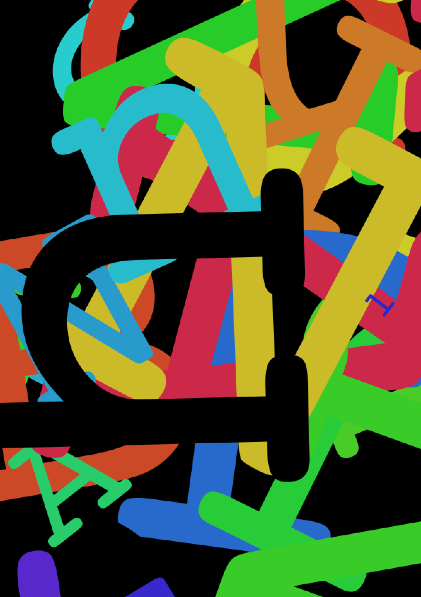

title:charRotoSettings
author:Andreas Breitwieser
date:25.08.22


# charRotovator 4EDi

## 

Um den rohen Code ausführen zu können brauchst du die kostenlose [Processing App](https://processing.org/download) und natürlich den 
Code von meiner [Github Seite](https://github.com/andreas-dora/charRotovator). Klick auf **CODE** und dann **Download Zip**. 


## Links 

- [Download Processing](https://processing.org/download) 
- [Git auf dem Mac einrichten](https://www.youtube.com/watch?v=_sLgRBrZh6o&t=168s)

 ---
  
  
## Voreinstellungen

Bevor Du loslegen kannst sollten ein paar Voreinstellungen gemacht werden. In der aktuellen Version besteht das Programm aus drei Dateien, in in der Processing App als drei Tabs dargestellt werden. 
Der erste Tab heißt genau so, wie die aktuelle Version des Programms. Alle Voreinstellung sind hier zu erledigen. 
Zu Beginn tauchen zwei Zeilen auf: 

```
String myPath = "";
String saveFormat = "png";
```

Hier geht es um das speichern von Bilddateien. 
Solange **myPath** leer ist werden Bilder in dem Ordner abgelegt, in dem auch die drei Programm Dateien liegen. Der Ordner ist nicht nur schlecht zu erreichen, bei einer Softwareaktualisierung ist er schnell überschrieben.
Hier kann der Pfad zu einem Wunsch-Ordner hinterlegt werden. Das sieht dann etwa so aus:
 
```
String myPath = "/Users/andi/Desktop/screenShots/"; 
```

Die Zeile **saveFormat** gibt das Dateiformat für die einfache Bildspeicherung **saveFrame()** vor. Neben 'png' sind 'tif', 'tga' und 'jpg' möglich.

----

Weiter gehts es etwa bei Zeile 30, innerhalb der Setup-Funktion.  

```
pixelDensity(1);
```

Bei der Benutzung eines hochauflösenden Displays wie kann **pixelDensity** auf **2** gesetzt werden. Bei werden einem 13" Macbook werden so vom Bildschirm Dateien mit 2880 x 1800 Pixeln gerendert.

--- 

## Font laden

```
mainFont = createFont("HelveticaNeue-Light",200);
```

Hier kann nun ein Wunsch-Font geladen werden. Die Funktion **createFont()** erwartet neben dem Dateiname auf jeden Fall auch eine Größe.




`
 
